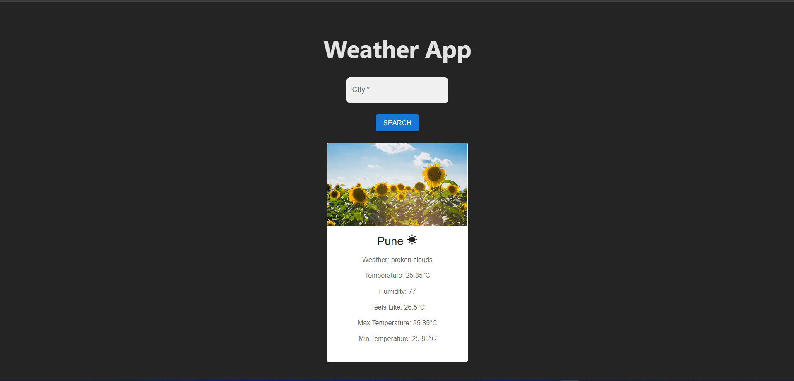

# 🌤️ WeatherVibe – A React Weather Info App

**WeatherVibe** is a clean and minimal app where users can search for any city and get real-time weather data including temperature, humidity, and a weather description — all displayed in a neat weather card UI.

---

## 🚀 Features

- 🔍 Search for weather by city name
- 🌡️ View temperature, humidity, min/max, and "feels like"
- 🌥️ See live weather conditions (e.g., "clear sky", "light rain")
- ⚛️ Built using React + Vite
- 🎨 Clean Material UI-based interface

---

## 🧰 Tech Stack

- React
- Vite
- Material UI
- OpenWeatherMap API

---

## 📦 Getting Started

### 1. Clone the repository

```bash
git clone https://github.com/neerajrao23/weatherVibe.git
cd weatherVibe
```

### 2.  Install dependencies

```bash
npm install
```

### 3. Setup your API key
Create a .env file in the root of the project and add:

```bash
VITE_WEATHER_API=your_openweathermap_api_key
```

### 4. Run the App

```bash
npm run dev
```

---

## 📸 Preview



---

### Made with ☀️ and ☕ by [Neeraj Rao](https://github.com/neerajrao23)
